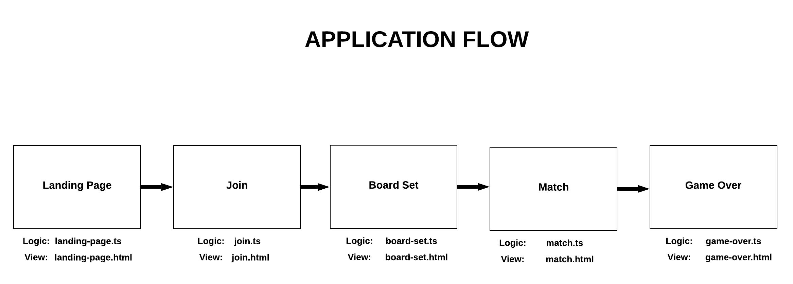

# Battleship

## Environment Setup

This project is built using Aurelia and Node.js, and it can be deployed using ZEIT. Here's how you can get started using each of these technologies:

### Node.js

If you're using a Mac, I recommend installing Node.js using Homebrew with the following command:  
`brew install node`

Otherwise, you can install Node.js in the environment of your choosing following the instructions found [here](https://nodejs.org/en/download/).

### Aurelia

Once you have Node.js installed, you'll be able to install the Aurelia CLI using the following command:  
`npm install -g aurelia-cli`

### ZEIT

In order to use ZEIT to deploy and host this application, you'll need to register an account for ZEIT by navigating [here](https://zeit.co/login). You'll be able to login using an email or a GitHub or GitLab account. ZEIT's login flow includes instructions for getting the CLI set up.

---

## Application flow

In Aurelia, routes are initialized in the [src/app.ts](src/app.ts) file. Each initialized route gets assigned both a view component and a view controller component—which must be named the same (excluding file extension). These routes dictate the application's flow. Take a look at the following diagram to see which files are associated with each route:

### Landing Page

On the landing page of this application two QR code squares are displayed so that players can join a match. When a player scans or clicks on a QR code square, the player is routed to their join page.

### Join Page

On the join page, players are prompted to enter a nickname for use in the match. After they enter and confirm a name, a waiting prompt is displayed until the other player enters and confirms their name. Once both players have entered and confirmed their names, the match kicks off and both players are routed to the board set page.

### Board Set

On the board set page, both players are prompted to place their ships. Once both players place their ships and press continue, both players are routed to the match page.

### Match

Match start! Players take turns making guesses. Board state is exchanged by the two players using a request/reply pattern over Solace.

### Game Over

When a player has sunk all of their opponent player's ships, the game is over. This screen displays which player won, and which lost.

---

## Deployment

If you have ZEIT installed, all you have to do to deploy this project is execute the following command with battleship_frontend as your working directory:

`now`
